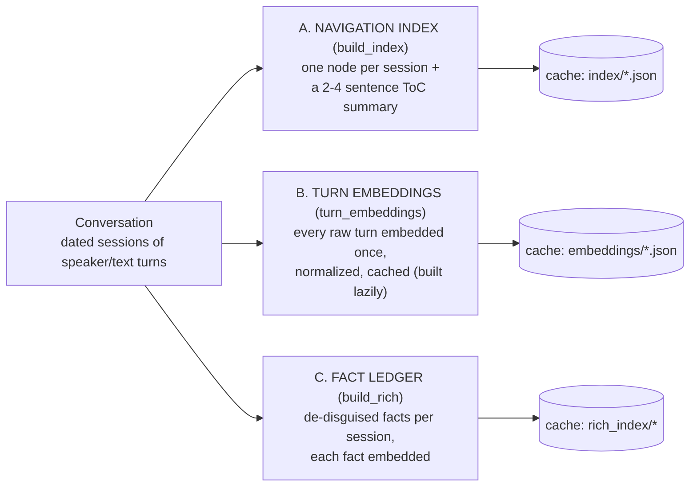
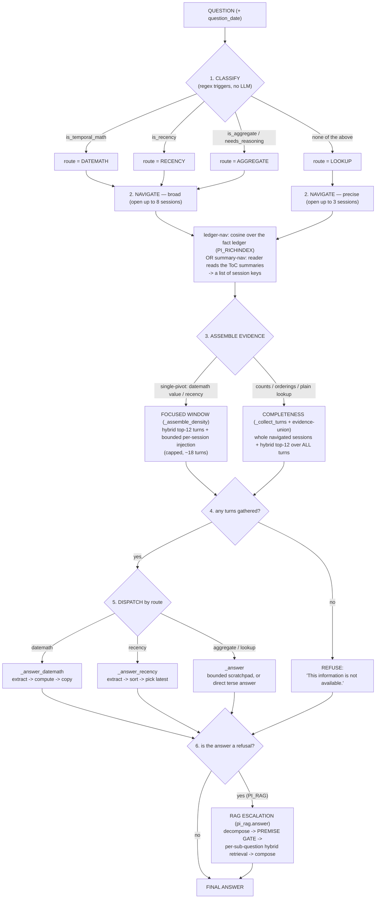
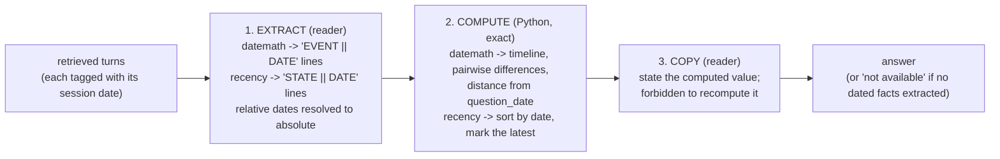
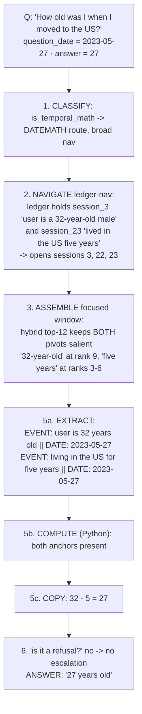

# skim — architecture

skim is a long-term memory system for LLM conversations. It answers questions about a long,
multi-session chat history **without ever feeding the full history to the model**. It builds a small,
navigable index once, then — per question — opens only the sessions it needs, reads their raw turns,
and either cites evidence or refuses.

**Two models, two roles:**

| role | model (default) | job |
|---|---|---|
| **compiler** | `gpt-4o-mini` | builds the index once (offline, cached); also the LLM judge during evaluation |
| **reader** | `gpt-4.1-mini` | answers every question (online) — cheap, because it reads a few sessions, not 115K tokens |

**Three principles, applied everywhere:**

1. **Read the index, not the book** — navigate to sessions; never stuff the whole transcript.
2. **The LLM extracts, Python computes** — dates, counts, and "latest value" are computed in code; the model only pulls facts and copies results.
3. **Cite or refuse** — every answer must be supported by retrieved raw turns, else the system returns *"This information is not available."*

---

## Glossary (every term used below, defined once)

- **Session** — one dated chat between the user and the assistant. A conversation is many sessions.
- **Node** — the index entry for one session: `{key, date, ToC summary, raw turns}`.
- **ToC summary** — the 2–4 sentence "table of contents" the compiler writes per session, describing what it covers. This is the map the reader navigates.
- **Fact ledger** — a per-session list of **de-disguised** facts: every concrete instance restated as *what it is*, cited to its turn (e.g. *"that one was out of my league"* → *"viewed a property [property viewing]"*). Used for **navigation only**; answers never come from it.
- **question_date** — the date the question is asked ("now"); the reference point for "… ago" arithmetic. On LongMemEval it is given per question; on LoCoMo it is the latest session's date.
- **Hybrid retrieval** — ranking raw turns by **cosine** similarity *and* **BM25** lexical overlap, fused. Catches both semantic matches and exact-term matches (a name, a date).
- **Premise gate** — a deterministic check: if retrieval finds **no evidence for what the question assumes**, refuse instead of answering.
- **Route** — which answer machine a question is sent to: `datemath`, `recency`, `aggregate`, or `lookup`.

---

## Phase 1 — offline: build the index (once, cached)

The compiler turns a conversation into three cached artifacts. The cost is paid once; every reader run reuses them.

- **A. Navigation index** — `pageindex.build_index`. One node per session; the compiler writes the ToC summary. This is what summary-navigation reads.
- **B. Turn embeddings** — `pi_rag.turn_embeddings`. Used by hybrid retrieval and the focused-window assembly. Built lazily (only conversations that escalate pay for it).
- **C. Fact ledger** — `rich_index.build_rich`. The de-disguised facts are embedded so navigation can find an incidental instance a ToC summary dropped. Cached in its **own** directory so it never touches artifact A.

---

## Phase 2 — online: answer one question (`pageindex.query`)

Six stages. Function names are the real ones in `pageindex.py`.

**Stage 1 — Classify.** Regex triggers pick the route and whether navigation goes broad or precise. Precedence is `datemath -> recency -> aggregate -> lookup`. No LLM call.

**Stage 2 — Navigate.** Two navigators, selected by the `PI_RICHINDEX` flag:
- **summary-nav** (`_navigate`): the reader reads the ToC summaries and names the sessions to open — reasoning over the map, no similarity math.
- **ledger-nav** (`rich_index.navigate_rich`): cosine of the question against the fact ledger; returns sessions whose best fact clears a relevance floor. Finds incidental instances the summaries dropped.

**Stage 3 — Assemble evidence.** Two paths, routed by `PI_DENSITY_SCOPE`:
- **Focused window** (`_assemble_density`) for **single-pivot** compute (one date value, the latest value): the reader gets a small retrieval-ranked window (hybrid top-12 + a bounded injection of turns from navigated sessions), so the one pivot fact stays salient instead of diluted in whole transcripts.
- **Completeness** (`_collect_turns` + evidence-union `_recency_retrieve`) for **counts, orderings, and plain lookups**: whole navigated sessions plus a hybrid top-12 over all turns — because a count needs *every* instance and a capped window would drop some.

**Stage 4 — Refuse if empty.** No turns gathered → *"This information is not available."*

**Stage 5 — Dispatch.** The route decides the answer machine (see next section for datemath/recency).

**Stage 6 — Escalate only on refusal.** If the base answer is a refusal, `pi_rag.answer` runs the residue: decompose the question into a premise-probe plus 2–4 sub-questions, apply the **premise gate**, hybrid-retrieve per sub-question, and compose. Its answer is adopted only if it recovers a non-refusal.

---

## The compute layer (datemath and recency)

The core of principle #2 — **the model never does the arithmetic**. datemath and recency share one shape:

- **datemath** (`_answer_datemath`) answers "how many days/months between X and Y" and "how long ago". The reader extracts dated events; Python (`_compute_block`) does the calendar math; the reader copies the number.
- **recency** (`_answer_recency`) answers "what is my current X" when X changed over time. The reader extracts the dated value history; Python sorts it and marks the latest; the reader answers the latest by default.

If extraction yields no dated facts, both fall back to the plain answer path.

---

## The mechanisms (flag-gated layers, all default off)

The base config is `PI_RAG + HYBRID + INFER`. Each mechanism below is a separate flag that adds one capability; the full config turns them all on.

| flag | plain name | the failure it fixes |
|---|---|---|
| `PI_RAG` `+HYBRID` `+INFER` `+GATE` | RAG escalation + premise gate | recover refused questions; refuse false premises instead of fabricating |
| `PI_NAV_BROAD` | broad navigation | a count scattered over more than 3 sessions can't be found by precise navigation |
| `PI_REASON` | scratchpad answer | multi-step questions need bounded serial reasoning, not a one-shot answer |
| `PI_DATEMATH` | date math in code | LLMs eyeball date arithmetic wrong (even GPT-4o got a two-event ordering backwards) |
| `PI_RECENCY` | value-history | "current X" when X changed — return the latest value, not the first one found |
| `PI_EVUNION` | evidence-union | reach a value/event the ToC summary erased, via cosine+BM25 over all turns |
| `PI_RICHINDEX` | ledger navigation | find an incidental instance a topic-summary dropped |
| `PI_DENSITY` | focused window | whole-session dumps dilute the one pivot fact the reader needs |
| `PI_DENSITY_SCOPE` | count-safe routing | the focused window drops instances a count/ordering needs |

Config ladder and per-benchmark numbers: see [RESULTS.md](RESULTS.md).

---

## Worked example — one question, traced through every stage

**Question:** *"How old was I when I moved to the United States?"* · **asked** 2023-05-27 · **correct answer:** 27

There is **no single turn** with the answer. It is a two-fact join: *current age* combined with *years lived in the US*. (This is question `d01c6aa8` from LongMemEval, run on the full config.)

Why each stage matters here:

- **Classify** routes to datemath, so the arithmetic will be done in Python, not eyeballed.
- **Ledger-nav** finds *both* gold sessions (3 and 23) — the de-disguised ledger surfaces "user is a 32-year-old male" and "lived in the US five years", which the ToC summaries (about visa paperwork) buried.
- **Focused window** is the deciding stage. Without it, dumping whole sessions 3+22+23 (~8,200 words of visa boilerplate) buries the "I am 32" turn and the reader answers *"5 years old"*. The capped window keeps both pivot turns salient → correct.
- **Extract → compute → copy** turns the two facts into `32 − 5 = 27` in code; the reader only copies.

---

## The honesty model

Fabrication is held down by three things:

1. **Cite-or-refuse prompt** — the reader is instructed to answer only from the retrieved turns, else refuse.
2. **Premise gate** — on RAG escalation, if retrieval finds no evidence for what the question *assumes* (e.g. "…before my job at Google" when there is no Google job), the system refuses rather than composing an answer from topically-near turns.
3. **Deterministic adversarial scoring** — a clean refusal on an unanswerable question is scored correct.

On LongMemEval this holds fabrication to **1.8%**.

**Known limitation (found via the LoCoMo walkthrough).** The premise gate guards only the **escalation** path — it fires *after* a refusal. A **confident base answer is not gated.** When broad-nav and ledger-nav over-retrieve (open many sessions of topically-adjacent material), the base reader can find something plausible and answer a false-premise question instead of refusing (e.g. *"What counseling workshop did she attend?"* — which never happened — answered with a *pottery* workshop it found nearby). This is the same un-gated base path that carries the residual 1.8% on LongMemEval; LoCoMo's 24%-unanswerable mix stresses it harder. The robustness fix this points at is **gate the base answer, not just the escalation path**.

---

## Where it is validated

| benchmark | config | result | note |
|---|---|---|---|
| **LongMemEval_S** (full 500) | full config | **0.766** official GPT-4o judge | beats GPT-4o full-context (0.606) at ~1/100th the reader cost; 1.8% fabrication |
| **LoCoMo** (all 10) | minimal config | **1.352** macro | the full-config mechanisms are net-negative here — LoCoMo conversations fit in context, so the large-haystack machinery over-retrieves and costs precision/honesty |

The mechanisms are a **large-haystack** story: they earn their keep when the history overflows the context window (LongMemEval's ~115K tokens), not when it fits (LoCoMo's ~16K). Full ladder and reproduce steps: [RESULTS.md](RESULTS.md). Query-flow-only diagrams: [PIPELINE_FLOW.md](PIPELINE_FLOW.md).
