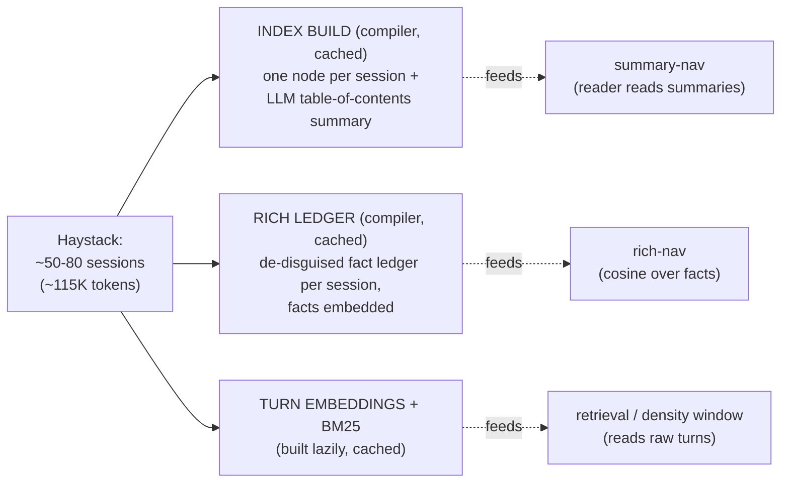
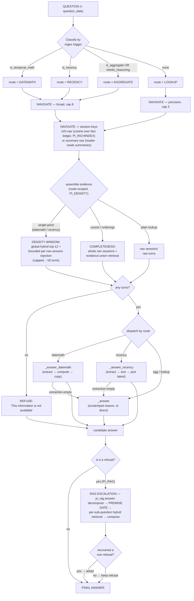
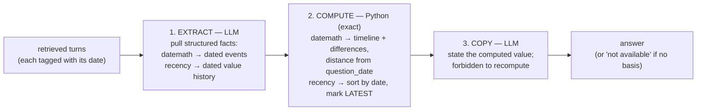

# skim — query-flow diagrams (0.766 best config)

**Config:** `PI_RAG + HYBRID + INFER + NAV_BROAD + REASON + DATEMATH + RECENCY + EVUNION + RICHINDEX + DENSITY + DENSITY_SCOPE`
**Result:** LongMemEval_S full-500 official **0.766**, reader = gpt-4.1-mini, fabrication 1.8%.

Two models: a **compiler** (gpt-4o-mini) builds the index once; a cheap **reader** (gpt-4.1-mini)
answers every query. The guiding principle: **the LLM extracts, Python computes** — arithmetic,
sorting, and date math are done in code, never in the model's head.

---

## 1. Offline — build once, cached

---

## 2. Query — the main flow

---

## 3. Inside a compute layer (datemath & recency share this shape)

This is the core idea — the LLM never does the arithmetic:

---

## Legend / notes

- **Navigation** picks *sessions*. Summary-nav (reader reads the LLM summaries, vectorless) is cheap
  but lossy — a summary drops incidental facts. **Rich-nav** (`PI_RICHINDEX`) embeds a de-disguised
  fact ledger and retrieves over it, so an incidental mention ("out of my league" = a property
  viewing) still opens its session. Answers always come from raw turns, never the ledger.
- **Density assembly** (`PI_DENSITY`) hands the reader a small retrieval-ranked window instead of
  whole sessions, keeping the pivot fact salient (~3.6× fewer reader tokens on compute questions).
  **Route scope** (`PI_DENSITY_SCOPE`) applies the cap only to single-pivot compute (datemath /
  recency); counts and orderings keep whole-session **completeness**, because a capped window drops
  instances a count needs.
- **Evidence union** feeds the completeness path: cosine+BM25 over all turns, so a value/event a
  summary erased still reaches the compute layer.
- **RAG escalation** fires only on a *refusal* — it re-answers the residue via decompose + a strict
  premise gate. This is what keeps fabrication low on answerable questions.
- **Honesty:** overall fabrication is **1.8%** (9/500); on unanswerable questions the system
  correctly refuses **70%** of the time. The residue is false-premise questions where retrieval still
  returns topically-near turns and the compute layer answers instead of refusing.

**Render:** GitHub, VS Code (Mermaid extension), or https://mermaid.live all display the diagrams.
