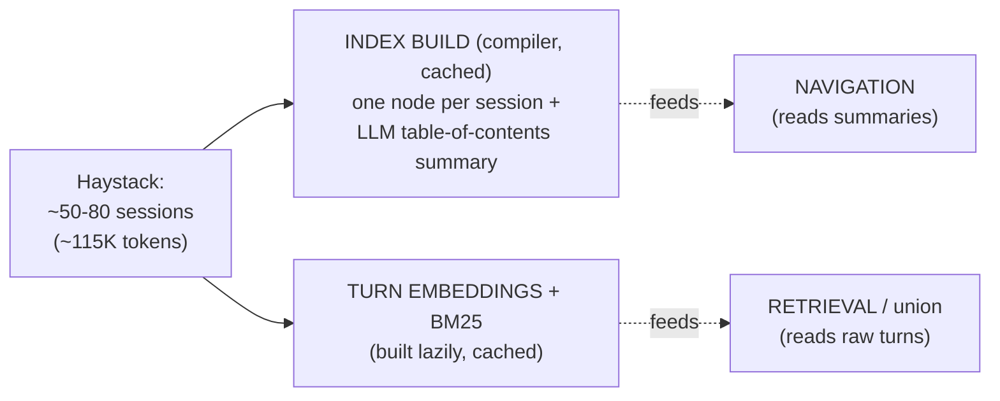
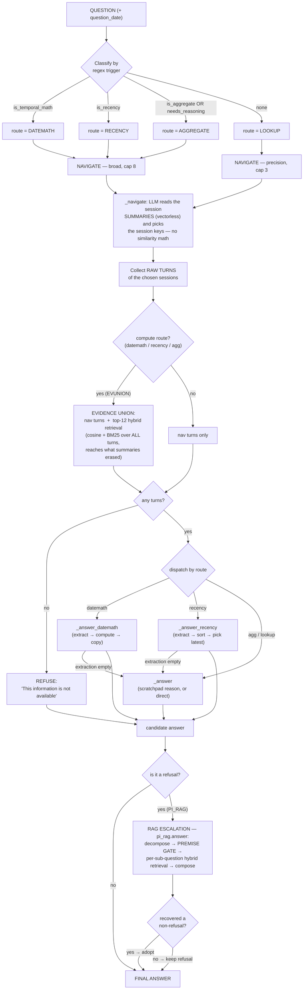
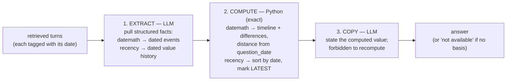

# PageIndex + RAG — Query Logic Flow (0.722 config)

**Config:** `PI_RAG + HYBRID + INFER + NAV_BROAD + REASON + DATEMATH + RECENCY + EVUNION`
**Result:** LongMemEval_S full-500 official **0.722**, reader = gpt-4.1-mini, fabrication 2.6%.

Two models: a **compiler** (gpt-4o-mini) builds the index once; a cheap **reader** (gpt-4.1-mini)
answers every query. The guiding principle: **the LLM extracts, Python computes** — arithmetic,
sorting, and date math are done in code, never in the model's head.

---

## 1. Offline — build once, cached

---

## 2. Query — the main flow

---

## 3. Inside a compute layer (datemath & recency share this shape)

This is the core idea — the LLM never does the arithmetic:

---

## Legend / notes

- **Vectorless navigation** picks *sessions* by having the reader read the LLM-written summaries —
  cheap, but lossy (a summary can drop an incidental fact, making its session unfindable).
- **Evidence union** (EVUNION) patches that lossiness for the compute routes: it also pulls raw
  turns by cosine+BM25, so a value/event the summary erased can still reach the compute layer.
- **RAG escalation** fires only on a *refusal* — it re-answers the residue via decompose + a strict
  premise gate. It is what keeps fabrication low on answerable questions (0.6%).
- **Where the 2.6% fabrication comes from:** the `EVIDENCE UNION → compute` path also runs when
  nav returns NONE. On a *false-premise* question (e.g. "…before my job at Google" when there is no
  Google job), retrieval still returns topically-near turns and the compute layer answers instead of
  refusing — 10 of 30 abstention questions. This is the known honesty tax of the 0.722 config.

**Render:** GitHub, VS Code (Mermaid extension), or https://mermaid.live all display the diagrams.
